<p align="center">
  <a href="https://maplebench.vercel.app/">
    
  </a>
</p>

<h1 align="center">🍁 MapleBench</h1>

<p align="center"><strong>Agent benchmarks for classic MMORPG gameplay.</strong></p>

<p align="center">
  <a href="https://github.com/dmarzzz/maplebench/actions/workflows/ci.yml"></a>
  
  
  <a href="LICENSE"></a>
</p>

<p align="center">
  <a href="https://maplebench.vercel.app/"><strong>Explore results</strong></a> ·
  <a href="https://maplebench.vercel.app/#trajectories">Watch recordings</a> ·
  <a href="https://maplebench.vercel.app/#approach">How it works</a> ·
  <a href="docs/ROADMAP.md">Roadmap</a>
</p>

MapleBench asks coding agents to play through a persistent MapleStory-like world.
The model reads structured game state and writes bounded JavaScript; that program
can observe the world and send ordinary keyboard inputs through a narrow SDK.
After logout, MapleBench verifies the character's saved XP and publishes the run
with its attribution, evidence, and gameplay recording.

> [!IMPORTANT]
> MapleBench is a development research preview, not a model ranking. Live combat
> can vary even from a frozen baseline. Reliable comparisons still need repeated,
> balanced trials and uncertainty reporting.

## The agent loop

<p align="center">
  
</p>

The clock includes inference and execution. Model-authored code runs in a
networkless sandbox and can only call the frozen SDK:

```js
const { character } = await sdk.observe();

if (character.hp < character.maxHp / 2) {
  await sdk.pressKeys(['HP_POTION'], 100);
}

await sdk.pressKeys(['LEFT'], 300);
await sdk.pressKeys(['PRIMARY_SKILL'], 650);
```

The current public preview covers four class fixtures with different movement,
skills, and combat patterns. Results are grouped by frozen task setup; failed,
incomplete, zero-action, and recovered attempts remain visible instead of being
quietly discarded.

## Simulation environment

Frozen comparison groups are assigned to isolated worker VMs. Each worker owns
its game world, database, browser client, program sandbox, and evidence bundle;
publication exports only the checked public artifacts.

<p align="center">
  
</p>

## Try the asset-free demo

Requires Node.js 22+.

```console
npm ci
npm test
npm run demo:live
```

Open <http://127.0.0.1:8787>. The demo exercises the SDK, event stream, scoring,
and live viewer against a tiny mock backend. It is not a game simulator and never
contributes benchmark scores.

## What's in the repo

| Path | Purpose |
| --- | --- |
| [`src/`](src/) | Protocol, TypeScript SDK, transport, and scoring |
| [`scripts/`](scripts/) | Full-client runner, verification, replay, and publication tooling |
| [`tasks/`](tasks/) | Frozen task specifications and agent prompts |
| [`configs/`](configs/) | Bounded experiment plans and scenario presets |
| [`ui/`](ui/) | Asset-free local viewer and dashboard source |
| [`docs/`](docs/) | Architecture, operations, methodology, and research plans |

For the real-client path, start with the [full-client guide](docs/FULL_CLIENT.md),
[runtime contract](docs/FULL_CLIENT_RUNTIME.md), and
[production-readiness criteria](docs/PRODUCTION_READINESS.md). The earlier
server-bot harness and replay renderer remain available, but their scores are
separate from full-client results.

## Research principles

- **Play, don't mutate.** Agents control a real in-world character through normal
  inputs; they do not edit stats or invoke hidden grinding policies.
- **Score what persists.** Hunting uses signed net XP saved after ordinary logout;
  in-session XP is diagnostic.
- **Keep the evidence.** Exact model attribution, action receipts, outcomes, and
  recordings stay bound to each attempt.
- **Compare like with like.** Models in a group share the declared class, baseline,
  prompt, tools, and budgets. A frozen database does not guarantee an identical
  live scene.

Longer-term work expands from XP optimization into richer class and navigation
tasks, then multi-agent party-quest coordination. See the
[benchmark design](docs/CLASS_BENCHMARK_DESIGN.md) and
[research framing](docs/RESEARCH_FRAMING.md).

## World, credits, and license

MapleBench integrates with the open-source
[Journey WASM](https://github.com/nmnsnv/maplestory-wasm) client and
[Cosmic](https://github.com/P0nk/Cosmic) server. Earlier observer and automation
work builds on [Maplewright](https://github.com/Sheilem/maplewright) and the
[Cosmic bot fork](https://github.com/NDBellisario/cosmic). The project was
inspired by [RuneBench](https://maxbittker.github.io/runebench/).

This repository contains no Nexon game assets or WZ data. MapleStory names,
imagery, and other third-party material belong to their respective owners;
MapleBench is independent and is not affiliated with or endorsed by Nexon.

Released under the [GNU AGPL v3](LICENSE).
