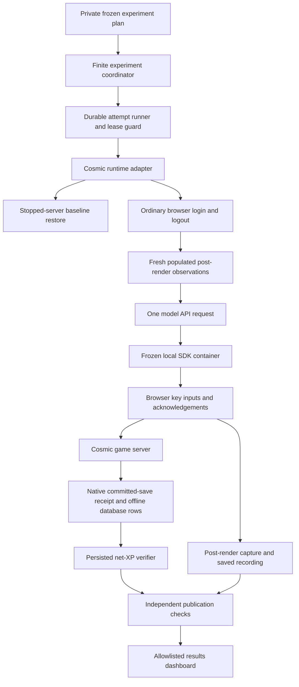

# MapleBench architecture

## Current full-client implementation

The full-client benchmark uses a rendered browser, one API-generated SDK program
per attempt, ordinary game inputs and offline persisted scoring. Its implemented
path is:



| Boundary | Implemented responsibility |
| --- | --- |
| `full_client_experiment.py` → `full_client_trial.py` | Predeclared IDs, aggregate reservations, durable submission, stop on failure, explicit advancement to unsubmitted attempts only. |
| Runner → `full_client_runtime.py` | Existing world/queue lock ownership, bounded guarded subprocesses, phase intents, exact attempt and source identity. |
| Runtime → `full_client_session.py` / `full_client_bridge.py` | One pinned renderer, ordinary lifecycle, readiness before API dispatch, exact requested/returned model and retained controller lease. |
| Bridge → `maple_agent.py` / `agent-sandbox.mjs` | Frozen local Docker endpoint/image/dispatcher, bounded API and program execution, acknowledged physical inputs. |
| Runtime → `full_client_collect.py` / `full_client_score.py` | Offline row collection, positive native save proof, unchanged level and character identity, signed persisted XP including penalties. |
| `full_client_publish.py` / `full_client_dashboard.py` | Independent artifact/capture/attribution checks, a separately bound recording review, explicit failed or incomplete attempts and unranked result groups. |

Runtime-host administrators, the native server and collection process are within
the trust boundary. Digests detect drift and bind receipts; they do not
authenticate a malicious host. Model code has no database reset, service-control
or score-writing interface. Private snapshots, model output, logs, credentials,
recordings and game assets stay outside Git. The local dashboard receives only
the allowed projection and deliberately exported recordings.

Matching frozen inputs establishes a common declared configuration. The readiness
gate establishes a populated live observation; neither establishes identical
monster positions or deterministic combat. See [production readiness](PRODUCTION_READINESS.md),
[finite experiments](FULL_CLIENT_EXPERIMENTS.md) and the
[actual acceptance evidence](FULL_CLIENT_ACCEPTANCE.md).

The sections below retain the original server-bot architecture and research
progression. Those event-stream scores and replay renders have separate
provenance from full-client persisted trials.

## Goal

Build a reproducible agent benchmark on top of an open-source MapleStory v83 server implementation while keeping the agent interface narrow, auditable, and physically grounded in the game simulation.

The first research progression is:

1. **Max XP** — long-horizon exploration and planning.
2. **XP rate** — execution and local policy optimization.
3. **Party quests** — multi-agent coordination, communication topology, role assignment, and recovery.

## Components

```text
Agent / coding model
        |
        | execute TypeScript using MapleClient
        v
+-----------------------+
| MapleBench SDK / MCP  |
+-----------+-----------+
            |
            | narrow action/observation protocol
            v
+-----------------------+
| Cosmic adapter        |
| - auth/episode gate   |
| - observe             |
| - physical actions    |
| - event logger        |
+-----------+-----------+
            |
            v
+-----------------------+
| Cosmic v83 server     |
| + bot movement/combat |
|   primitives          |
+-----------+-----------+
            |
       same world state
            |
     +------+------+
     |             |
     v             v
 verifier       observer renderer
 events         (Maplewright/client)
     |             |
     v             v
 score.json      run.mp4
```

## Why an adapter instead of server mutation

The upstream Cosmic bot fork already contains movement/navigation, combat, inventory, skill, potion, party and PQ automation machinery. We should reuse its low-level *physical execution* primitives, but never expose high-level policy functions such as grind, auto-quest, auto-equip, or server-side teleporting to evaluated agents.

A valid action must obey normal game timing and rules and should be visible to ordinary clients in the same map.

## Server-authoritative event stream

Scoring must be based on an append-only event stream emitted by the adapter/server, not values supplied by the agent or renderer.

Minimum events for v0:

- episode_start
- action
- xp_gain
- level_up
- map_change
- death
- episode_end

This makes scoring independent of EXP reset on level-up and gives us a deterministic trace for later analysis/replay.

## Determinism

We should distinguish two modes:

- **benchmark mode**: fixed seed, fixed initial DB snapshot, fixed content/data, fixed tick/time scale.
- **demo mode**: can use less strict rendering/client timing as long as the score remains server-authoritative.

Full bit-for-bit server determinism is a later hardening milestone; v0 only needs reproducible initial state plus logged RNG seed(s) and enough event data to diagnose variance.

## Agent interface

Expose observations plus low-level actions:

- observe
- moveTo
- attack
- useSkill
- loot
- useItem
- enterPortal
- allocateAp
- allocateSp
- say (multi-agent phase)

Explicitly do **not** expose:

- setLevel / addExp / setMesos
- warp / teleport-to-map
- spawn/kill monster
- grind / farm / patrol
- autoQuest
- autoEquip / optimizeBuild
- inspect hidden server state outside the agent's observation budget

## MCP shape

RuneBench's strongest interaction pattern is to let coding agents write short programs rather than make one model call per game action. MapleBench should therefore expose one primary MCP tool such as `execute_code`, with `MapleClient` pre-imported in a restricted runtime.

The exact MCP sandbox can come after the server adapter exists; the TypeScript SDK in this repo is the contract it will expose.
